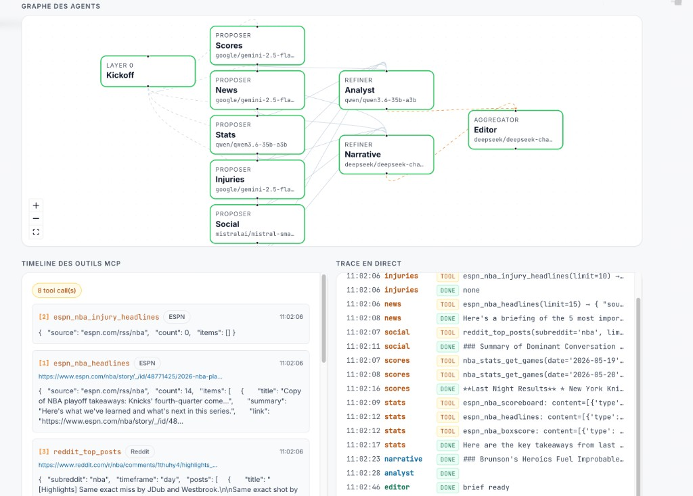
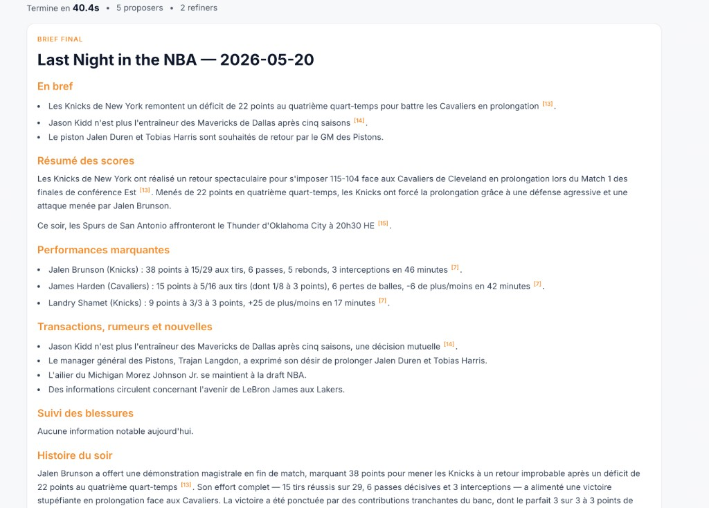
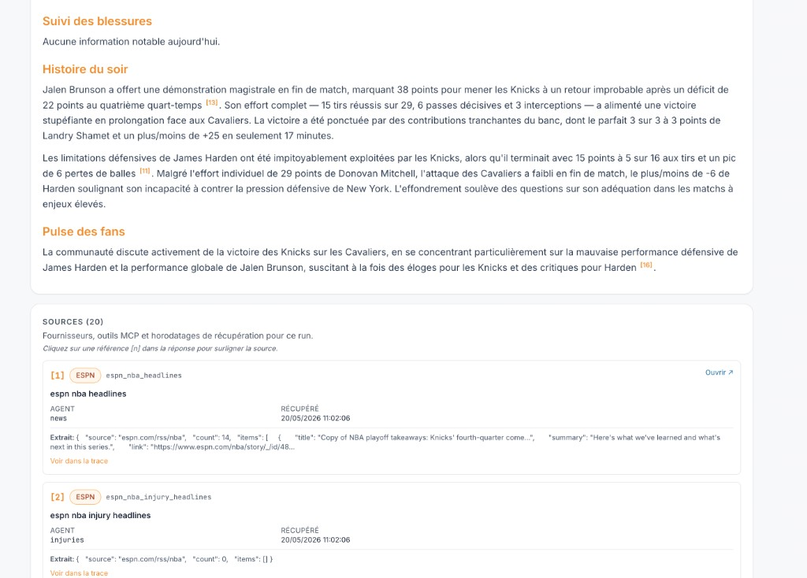
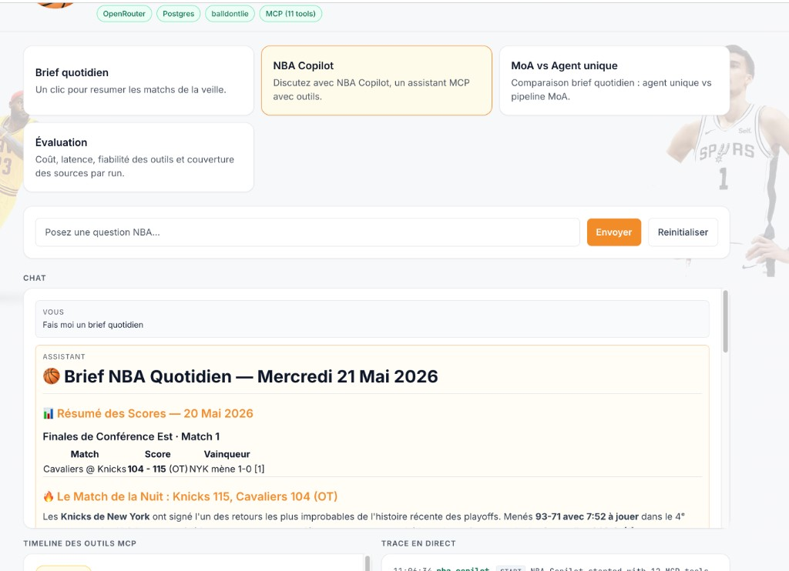
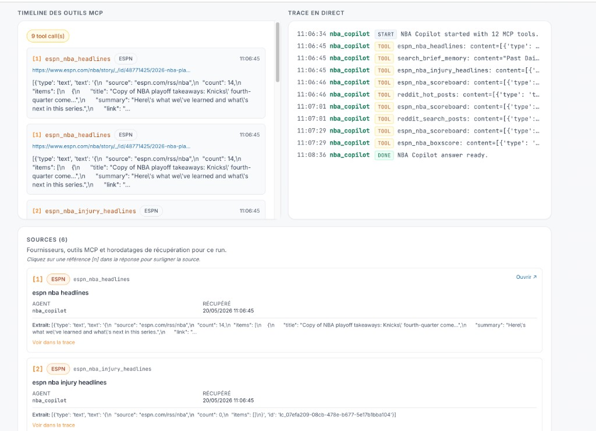
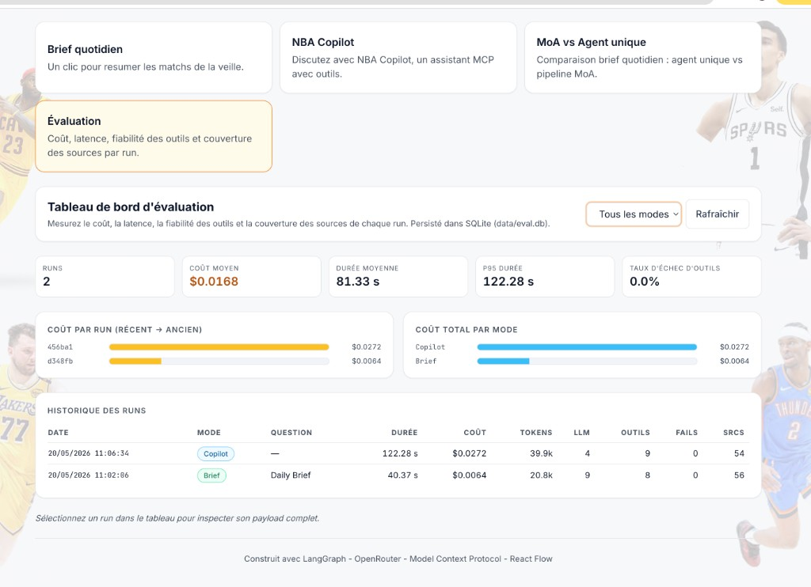
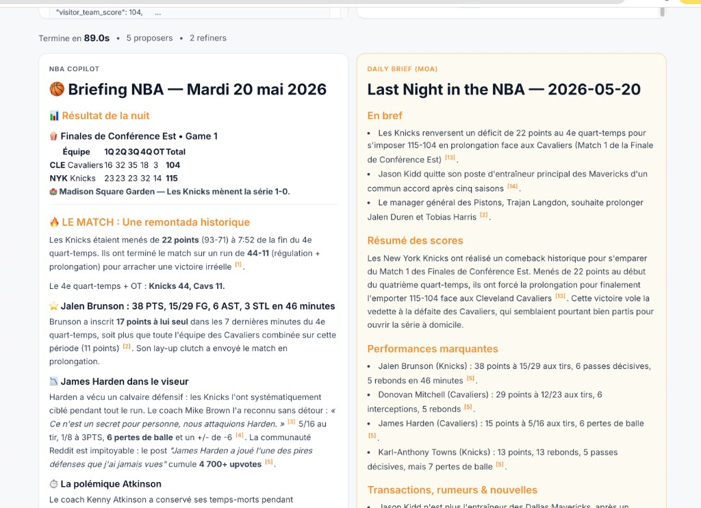

# NBA MoA Agents

> A **Mixture of Agents** system that produces a structured daily NBA briefing and includes **NBA Copilot** — a multi-turn, MCP-powered research chat — built with LangGraph, OpenRouter and the Model Context Protocol.

[](https://github.com/svensundell/nba_moa_agents/actions/workflows/ci.yml)


**Contents:** [Why](#why-this-project) · [Stack](#tech-stack) · [Case study](docs/case-study.md) · [LLMOps](docs/llmops.md) · [Testing](docs/testing.md) · [Architecture](#architecture) · [Modes](#four-demo-modes) · [Trade-offs](#engineering-trade-offs) · [Screenshots](#screenshots) · [Quick start](#quick-start) · [Structure](#project-structure)

## Why this project?

Most "Mixture of Agents" demos are abstract chat playgrounds. This one solves a concrete problem:

> *A structured NBA briefing for last night, plus **NBA Copilot** to dig deeper with live data.*

The implementation treats that workflow as a real system: runs are measured, sources are cited, and the stack is meant to be run and extended by someone else (`docker compose up`, tests, typed API).

**What ships today:**

1. **Observable runs** — every invocation is tracked (`RunTracker` → Postgres `runs`/`agent_metrics`/`tool_calls`): cost per run and per agent, token usage, LLM/MCP latency, tool failure rate, source coverage, wall-clock per graph node. The **Evaluation** tab charts history, filters by mode, and compares MoA vs single-LLM cost on `compare` runs.
2. **Source traceability** — each MCP call becomes a numbered `SourceCitation` (provider, tool, retrieval time, URL when available, payload excerpt). The **Daily Brief** editor receives a source index and can cite `[1]`, `[2]` inline; the UI links citations to the live tool timeline and a **Sources** bibliography. *(Semantic "click any phrase → tool output" and Copilot post-pass citations are on the [roadmap](#roadmap).)*
3. **MoA + MCP** — 9 specialised agents on 3 layers across **5 model families** via OpenRouter; **three custom MCP servers, 11 tools**, strictly MCP-driven (no HTTP fallbacks). The servers are reusable in any MCP client (Claude Desktop, Cursor, etc.).
4. **Hybrid orchestration** — `brief` / `compare` use a *deterministic* LangGraph MoA pipeline (repeatable daily recap). **NBA Copilot** (`query`) uses a *dynamic* tool-using `create_agent` with multi-turn chat. **Compare** runs both in parallel (MoA brief vs Copilot on the same prompt).
5. **Brief memory for Copilot** — each Daily Brief is chunked, embedded (OpenRouter), and stored in Postgres `briefs` + `chunks` (`pgvector` for similarity). NBA Copilot can call `search_brief_memory` to retrieve past storylines (e.g. “why is everyone talking about the Pacers this week?”) alongside live MCP tools.

Planned next: scheduled briefs, public demo deploy. See [Roadmap](#roadmap).

For a portfolio-style project narrative, see [`docs/case-study.md`](docs/case-study.md).  
For evaluation / LLMOps detail, see [`docs/llmops.md`](docs/llmops.md).  
For tests and CI, see [`docs/testing.md`](docs/testing.md).

## Tech stack

| Layer | Choices |
|-------|---------|
| **Orchestration** | LangGraph (MoA `brief` / `compare`), LangChain `create_agent` (NBA Copilot) |
| **Models** | OpenRouter — 5 families (Gemini Flash, Qwen, Mistral, DeepSeek, …) with per-agent routing |
| **Data** | 3 custom MCP servers (stdio) — ESPN, balldontlie, Reddit; no direct HTTP in agents |
| **API** | FastAPI, WebSockets (`/api/ws/run`), Pydantic v2 |
| **Persistence** | PostgreSQL 16 + `pgvector`, SQLAlchemy async, Alembic |
| **Observability** | `RunTracker` → `runs` / `agent_metrics` / `tool_calls` + in-app Evaluation dashboard |
| **Memory** | Section chunking, OpenRouter embeddings, cosine search + keyword fallback |
| **Frontend** | React 18, Vite, TypeScript, Tailwind, React Flow (agent graph + MCP timeline) |
| **Ops** | Docker Compose, Makefile, GitHub Actions (Ruff, mypy, pytest, frontend build) |

## Engineering trade-offs

| Topic | Choice | Why |
|-------|--------|-----|
| **Daily Brief orchestration** | Deterministic LangGraph MoA | Repeatable sections, parallel specialists, comparable runs for eval — better than one-shot prompting for a fixed recap format. |
| **NBA Copilot** | Dynamic tool-using agent | Open-ended questions need adaptive tool planning; a fixed graph would be brittle. |
| **Data boundary** | MCP-only (no HTTP fallbacks in agents) | Auditable tool calls, portable servers (Claude Desktop, Cursor), clear failure surface when a provider is down. |
| **Model sizing** | Smaller/faster models on L1 proposers; larger models on refiners + editor | Most cost is in breadth (5 parallel proposers); synthesis needs stronger reasoning, not the other way around. |
| **`stats` proposer** | Nested tool-using agent (cap ~6 calls) | Box scores need multi-step retrieval; a single hard-coded tool chain would miss edge cases. |
| **Hallucination control** | MCP-grounded bullets + `analyst` refiner + numbered citations in the editor | No silver bullet — combination of retrieval, cross-check, and mandatory source index for the final brief. |
| **Tool failures** | Recorded in metrics; agents emit explicit errors; no silent fallback to scraped HTML | Fails visibly in the UI and in the failure-rate gauge — easier to debug than wrong data. |
| **Cost visibility** | Per-agent token + USD estimates in Postgres | Tunes model routing and tool caps with data, not guesswork. |
| **Observability** | Postgres eval store + live WebSocket trace | Self-contained demo; same signals export cleanly to Langfuse/OTel on client projects — see [`docs/llmops.md`](docs/llmops.md). |
| **Brief memory** | Temporal RAG over past briefs (`pgvector`) + live MCP tools | Copilot answers “this week” storylines from archives while still pulling fresh scores/headlines when needed. |

## Architecture

```
                   ┌──────── kickoff ────────┐
                   │                         │
   ┌────┬────┬─────┴────┬──────────┬─────────┴──────────┐
   ▼    ▼    ▼          ▼          ▼                    ▼
 scores news stats   injuries   social
   L1   L1  L1*        L1         L1
    └────┴───┬┴──────────┴──────────┘
             ▼
       ┌─────┴─────┐
       ▼           ▼
    analyst    narrative
       L2         L2
       └─────┬─────┘
             ▼
          editor (L3)
             ▼
            END
```

`L1*` = the `stats` proposer is a **tool-using LangChain agent**: it autonomously decides which ESPN/balldontlie tools to call to get exact statlines.

LangGraph executes nodes that share an incoming edge in **parallel**, so layer-1 fans out concurrently. Layer-2 waits for the layer-1 join, then fans out again. The editor finally synthesises everything. See [`docs/architecture.md`](docs/architecture.md) for the full deep dive.

### Agent → model → MCP tool lineup

| Agent       | Layer       | OpenRouter model                              | MCP tool(s) it calls |
|-------------|-------------|-----------------------------------------------|----------------------|
| `scores`    | proposer    | `google/gemini-2.5-flash`                     | `nba_stats_get_games` (yesterday + today) |
| `news`      | proposer    | `google/gemini-2.5-flash`                     | `espn_nba_headlines` |
| `stats`     | proposer\*  | `qwen/qwen3.6-35b-a3b`                        | `espn_nba_scoreboard`, `espn_nba_boxscore`, `espn_nba_headlines`, `nba_stats_get_games`, `nba_stats_search_players` |
| `injuries`  | proposer    | `google/gemini-2.5-flash`                     | `espn_nba_injury_headlines` |
| `social`    | proposer    | `mistralai/mistral-small-24b-instruct-2501`   | `reddit_top_posts` / `reddit_search_posts` |
| `analyst`   | refiner     | `qwen/qwen3.6-35b-a3b`                        | (no tool — fact-checks the proposals) |
| `narrative` | refiner     | `deepseek/deepseek-chat-v3.1`                 | (no tool — finds storylines) |
| `editor`    | aggregator  | `deepseek/deepseek-chat-v3.1`                 | (no tool — composes the final brief) |
| `nba_copilot` | NBA Copilot / compare baseline | `deepseek/deepseek-v4-pro` | **all 11 MCP tools** (autonomous tool selection) |

\* `stats` is a tool-using agent: it plans up to ~6 tool calls per run to ground its bullets in **exact statlines** lifted from ESPN's boxscore data.

### MCP servers (all custom, all in this repo)

| Server          | Path                              | Wraps               | Tools |
|-----------------|-----------------------------------|---------------------|-------|
| **`nba_stats`** | `mcp_servers/nba_stats/server.py` | balldontlie.io v1   | `get_games`, `search_players`, `list_teams`, `team_recent_games` |
| **`reddit`**    | `mcp_servers/reddit/server.py`    | Public Reddit JSON  | `top_posts`, `hot_posts`, `search_posts` |
| **`espn`**      | `mcp_servers/espn/server.py`      | ESPN NBA RSS + site API | `nba_headlines`, `nba_injury_headlines`, `nba_scoreboard`, `nba_boxscore` |

All three are launched as **stdio subprocesses** by `langchain_mcp_adapters.MultiServerMCPClient` at FastAPI startup, with `tool_name_prefix=True` so each tool surfaces as `<server>_<tool>` (e.g. `nba_stats_get_games`, `espn_nba_boxscore`).

## Four demo modes

| Mode                  | Orchestration          | What it does |
|-----------------------|------------------------|--------------|
| **Daily Brief**       | Deterministic LangGraph MoA | One click → a structured 7-section briefing for last night (Quick Hits / Box Score Recap / Standout Statlines / Trades & News / Injuries Watch / Storyline / Fan Pulse). |
| **NBA Copilot** | Dynamic LangChain `create_agent` | Multi-turn NBA chat with tool-using reasoning. The agent decides which MCP tools to call from conversation context, and tool decisions stream live to the UI. |
| **MoA vs NBA Copilot** | LangGraph MoA + parallel NBA Copilot (`open_query`) | Same prompt, side by side: fixed specialist pipeline vs one tool-using agent with all MCP tools. |
| **Evaluation Dashboard** | Persisted run metrics (Postgres) | Cost (USD), token usage, per-agent latency, MCP tool failure rate and source coverage for every run. MoA vs single-LLM cost ratio is charted for `compare` runs. |

### Evaluation & observability (LLMOps)

Each run is tracked by `RunTracker` (ContextVar-scoped) and stored in Postgres:
**cost**, **tokens**, **LLM/MCP latency**, **tool failures**, **source coverage**, and **per-node wall-clock**. The **Evaluation** tab charts history across Daily Brief, Copilot, and Compare runs (MoA vs Copilot cost on the same prompt).

Full detail — metrics schema, instrumentation flow, API, screenshots, tuning guide:
[`docs/llmops.md`](docs/llmops.md).

### Source traceability

Every run also returns a structured bibliography in `RunResult.source_citations`
(`SourceCitation`: numbered id, provider, MCP tool name, agent, retrieval
timestamp, optional URL, excerpt of the raw tool payload).

| Layer | What happens |
|-------|----------------|
| **MCP calls** | `mcp_invoke` (brief proposers) and `record_streamed_tool_call` (NBA Copilot) call `RunTracker.record_mcp_citation()` — see `app/moa/citations.py`. |
| **Live UI** | Tool events carry `citation_id`, `provider`, `retrieved_at`, `source_url` for the MCP timeline. |
| **After the run** | `runner._attach_citations()` merges tracker citations + proposal URLs into `source_citations`. |

**Daily Brief** — before the editor writes, `editor_agent` builds a numbered
index (`format_citation_index`) from all MCP calls so far and passes it in the
user prompt. The editor is instructed to add inline markdown citations `[1]`,
`[2]`, … matching that index. The frontend turns `[n]` into clickable links
that scroll to the matching source card and highlight the tool step.

**NBA Copilot** — the tool-using agent does **not** receive that index in its
chat messages today. It sees raw tool JSON inside its ReAct loop; citations are
recorded in the tracker as tools finish, and the UI shows the full **Sources**
section after the answer. Inline `[n]` in Copilot answers are best-effort only
until a post-pass injects the index (roadmap).

### Brief memory (NBA Copilot)

After each **Daily Brief** run, the final markdown is chunked by section,
embedded via OpenRouter (`MEMORY_EMBEDDING_MODEL`), and stored in Postgres
(`chunks.embedding` as `pgvector`). NBA Copilot exposes a `search_brief_memory` tool (last
`MEMORY_DEFAULT_DAYS` days by default) so questions like *“Why is everyone
talking about the Pacers this week?”* can combine **archived brief context**
with **live MCP data**. New briefs are indexed automatically after each successful Daily Brief run.

## Screenshots

Capture the app locally (`make dev` + `make dev-frontend`), then add PNGs under [`docs/images/`](docs/images/) and they render here:

### Daily Brief

| Agent graph, MCP timeline & live trace |
|--------------------------------------|
|  |

| Brief output (scores, news, stats) | Brief output (narrative & sources) |
|------------------------------------|----------------------------------|
|  |  |

| Evaluation dashboard |
|----------------------|
|  |

### NBA Copilot

Multi-turn chat with MCP tools and brief memory (`search_brief_memory`). Each run is recorded in the same **Evaluation** store as Daily Brief (cost, latency, tool calls, sources).

| Chat & streamed answer |
|------------------------|
|  |

| MCP timeline, live trace & sources |
|----------------------------------|
|  |

| Evaluation dashboard (Brief + Copilot runs) |
|---------------------------------------------|
|  |

### MoA vs NBA Copilot

Same prompt, two pipelines in parallel: **Daily Brief MoA** (deterministic LangGraph) vs **NBA Copilot** (tool-using agent, all MCP tools). Costs are split in the Evaluation tab (`moa_cost_usd` vs `baseline_cost_usd`).

| Side-by-side answers |
|--------------------|
|  |

| Evaluation dashboard (Compare runs) |
|-------------------------------------|
|  |

**Demo video** — TODO 

## Quick start

### Prerequisites

- Python 3.11+ and Node.js 20+ (local dev), **or** Docker + Docker Compose v2 (containerised run)
- An [OpenRouter API key](https://openrouter.ai/) (one key, all the models the agents use)
- Optional: a [balldontlie API key](https://www.balldontlie.io/) for higher-quota NBA stats requests

### Run locally

```bash
# 1. Configure
cp .env.example .env
# fill in OPENROUTER_API_KEY (required) and BALLDONTLIE_API_KEY (optional)

# 2. Install + start Postgres + backend (from repo root)
make install
make dev
# Migrations run automatically on startup (AUTO_MIGRATE=true)

# 3. Frontend (second terminal)
make dev-frontend
```

Equivalent manual steps: `docker compose up -d postgres`, then `cd backend && uv run uvicorn app.main:app --reload --port 8000`, then `cd frontend && npm run dev`.

Open <http://localhost:5173>.

### Database migrations (Alembic)

On startup the backend runs `alembic upgrade head` when `AUTO_MIGRATE=true` (default in `.env.example`). Docker Compose applies migrations before serving traffic.

```bash
cd backend

# Optional: run migrations manually (e.g. AUTO_MIGRATE=false)
alembic upgrade head

# Create a new migration after schema changes
alembic revision -m "describe change"
```

### Run with Docker

Requires [Docker](https://docs.docker.com/get-docker/) and Docker Compose v2.

```bash
# 1. Configure (OPENROUTER_API_KEY is required)
cp .env.example .env

# 2. Build and start postgres + backend + frontend
docker compose up --build
```

| URL | Purpose |
|-----|---------|
| <http://localhost:5173> | Web UI (nginx serves the React build and proxies `/api` to the backend) |
| <http://127.0.0.1:8001/docs> | FastAPI Swagger (direct backend access) |
| <http://127.0.0.1:8001/api/health> | Health check |

The backend waits for Postgres (`pgvector/pgvector`) health before booting MCP.
The frontend container waits until the backend healthcheck passes (MCP servers
can take up to ~90s on first boot). Postgres data is stored in Docker volume
`pg_data`.

```bash
# Detached mode
docker compose up --build -d

# Stop and remove containers
docker compose down
```

**Port notes**

- The UI is published on **5173** (same as local `npm run dev`).
- The API is exposed on **8001** (not 8000) so you can keep a local
  `uvicorn` on `:8000` while Docker is running.
- Prefer **http://127.0.0.1:5173** if another process already owns port 8000
  on `localhost` via IPv6 (common with an old Docker container on macOS).

### Run from the CLI (no frontend)

```bash
cd backend && source .venv/bin/activate
python -m scripts.demo brief
python -m scripts.demo query "How is Luka Doncic playing this season?"
python -m scripts.demo compare "What should the Lakers do at the deadline?"
```

## Project structure

```
nba_moa_agents/
├── backend/
│   ├── app/
│   │   ├── main.py              FastAPI entrypoint (MCP lifespan)
│   │   ├── api/                 REST + WebSocket routes (/brief, /query, /compare, /ws/run)
│   │   ├── moa/
│   │   │   ├── graph.py         LangGraph StateGraph for brief & compare modes
│   │   │   ├── state.py         Shared state schema + AgentEvent
│   │   │   ├── llm.py           OpenRouter model registry + agent → model mapping
│   │   │   ├── open_query.py    Tool-using LangChain agent for NBA Copilot
│   │   │   ├── citations.py     SourceCitation helpers (MCP → numbered bibliography)
│   │   │   └── agents/          Per-agent logic + prompts (proposers / refiners / editor)
│   │   ├── mcp/                 MCPRegistry: launches & caches the 3 MCP servers
│   │   ├── eval/                RunTracker + SQLAlchemy repo/models (Postgres metrics)
│   │   ├── memory/              Brief chunking, pgvector retrieval, RAG for NBA Copilot
│   │   └── core/                Config & logging
│   ├── alembic/                 Database migrations (Postgres + pgvector)
│   ├── scripts/demo.py          CLI demo runner
│   └── tests/                   Smoke + MCP helper + graph structure tests
├── mcp_servers/
│   ├── nba_stats/               Custom MCP server (balldontlie wrapper)
│   ├── reddit/                  Custom MCP server (public Reddit JSON wrapper)
│   └── espn/                    Custom MCP server (ESPN RSS + site API wrapper)
├── frontend/                    React 18 + Vite + TypeScript + Tailwind + ReactFlow
│   ├── src/App.tsx              Mode tabs · agent graph · MCP tool timeline · live trace
│   ├── src/components/          SourcesBibliography, CitedMarkdown, EvalDashboard, …
│   └── src/api.ts               REST + WebSocket client
├── docker-compose.yml
├── Makefile                     make dev | test | lint | migrate | docker-up
├── .github/workflows/ci.yml     Ruff, mypy, pytest, frontend build
└── docs/
    ├── architecture.md
    ├── case-study.md          Portfolio narrative (problem → architecture → results)
    ├── llmops.md              Evaluation metrics, instrumentation, dashboard
    ├── testing.md             Test matrix, CI pipeline, local commands
    └── images/                README screenshots (daily-brief-*, copilot-*, compare-*)
```

### Testing and CI

[](https://github.com/svensundell/nba_moa_agents/actions/workflows/ci.yml)

Every push/PR runs **Ruff**, **mypy**, **pytest** (smoke + Postgres/`pgvector` integration), and a **frontend production build**. No live LLM or MCP subprocess calls in CI — graph structure, eval/memory repos, and MCP helper logic are covered deterministically.

```bash
make lint               # Ruff check + format check
make typecheck          # Mypy (LangChain/MCP overrides in backend/pyproject.toml)
make test               # Backend pytest + frontend build (same as CI)
make test-integration   # Postgres only (TEST_DATABASE_URL, DB nba_test)
```

Details: [`docs/testing.md`](docs/testing.md).

## Plug the custom MCP servers into Claude Desktop / Cursor

The three MCP servers in `mcp_servers/` are reusable on their own — drop them into any MCP-aware client:

- [`mcp_servers/nba_stats/README.md`](mcp_servers/nba_stats/README.md) — NBA games, players, teams (free-plan-safe)
- [`mcp_servers/reddit/README.md`](mcp_servers/reddit/README.md) — r/nba (or any subreddit) JSON wrapper
- [`mcp_servers/espn/README.md`](mcp_servers/espn/README.md) — ESPN NBA RSS feed + scoreboard + per-player boxscores

## Roadmap

- [x] Project scaffolding
- [x] LangGraph MoA pipeline
- [x] 9 specialised NBA agents on 5 model families
- [x] Three custom MCP servers (nba_stats, reddit, espn)
- [x] Strictly MCP-driven data layer (no HTTP fallbacks)
- [x] Hybrid orchestration: deterministic MoA for `brief`, dynamic multi-turn tool-using agent for NBA Copilot
- [x] FastAPI + WebSocket streaming with live MCP tool timeline
- [x] React frontend with ReactFlow agent graph + tool timeline
- [x] MoA vs NBA Copilot comparison
- [x] CLI demo runner
- [x] Evaluation dashboard: cost / latency / tool-failure / source-coverage per run, persisted to Postgres
- [x] Structured source citations (MCP → `source_citations`, Sources panel, timeline metadata)
- [x] Daily Brief: editor receives numbered source index + inline `[n]` citations
- [x] Brief memory: chunk + embed Daily Briefs; `search_brief_memory` tool for NBA Copilot
- [x] Docker Compose, Makefile, GitHub Actions CI, Ruff/mypy/pytest
- [ ] NBA Copilot: post-pass to inject source index so `[n]` in answers match the bibliography
- [ ] Click arbitrary phrase → tool output (semantic trace-back, not only `[n]`)
- [ ] Scheduled daily briefing (cron + email/Slack)
- [ ] Brief history UI (browse indexed briefs in the frontend)
- [ ] Deployment guide (Fly.io / Render)

## License

MIT
