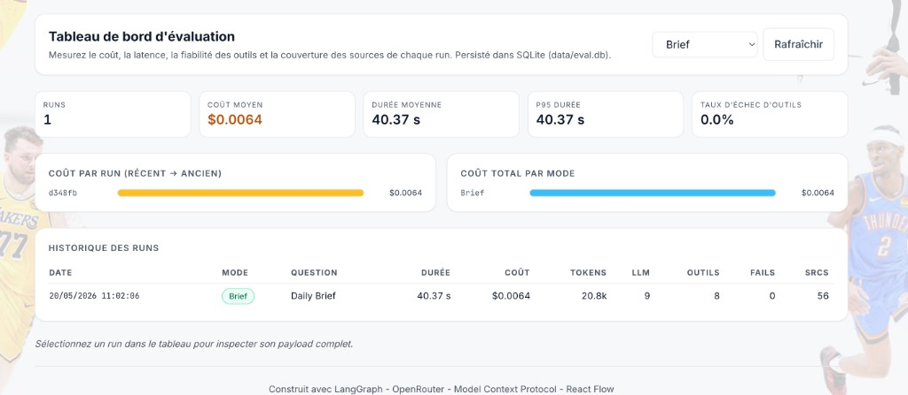
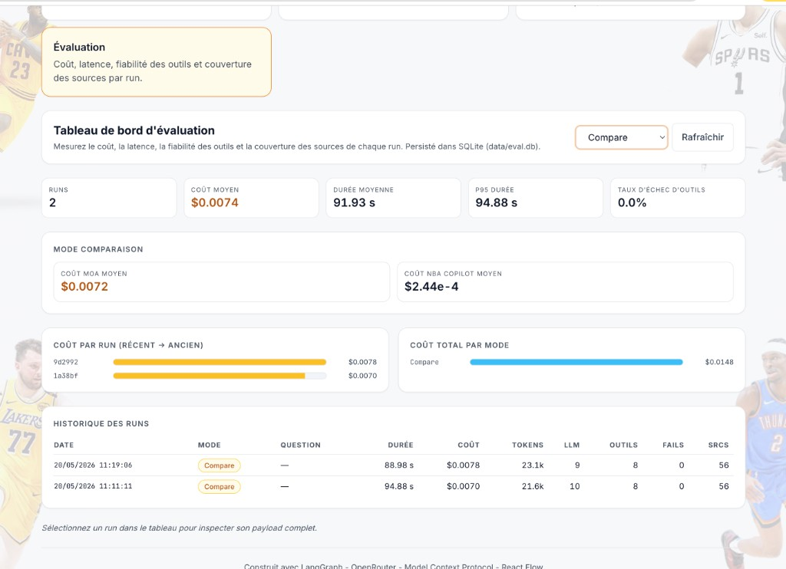

# Case Study — NBA MoA Agents

## One-line summary

Built an agentic NBA analysis system combining a deterministic Mixture-of-Agents pipeline for structured daily briefings and a dynamic tool-using copilot for open research questions, with end-to-end observability, source traceability, and temporal RAG memory.

## Context and objective

Most LLM demos stop at "it answers."  
The objective here was different: ship a system that behaves like a real product surface:

- reliable output shape for a repeatable daily workflow;
- grounded answers from explicit data tools;
- measurable cost/latency/failure signals;
- architecture that another engineer can run and extend quickly.

The product problem is intentionally concrete:

- **Daily Brief**: "What happened in the NBA last night?"
- **NBA Copilot**: "Help me investigate a storyline with live data + past context."

## What I built

### 1) Two orchestration patterns in one product

- **Deterministic LangGraph MoA** for `brief`:
  - parallel specialist proposers (`scores`, `news`, `stats`, `injuries`, `social`);
  - refinement layer (`analyst`, `narrative`);
  - constrained final editor with a fixed 7-section structure.
- **Dynamic tool-using agent** for `query`:
  - multi-turn copilot based on LangChain `create_agent`;
  - autonomous MCP tool selection depending on user intent.

This split is deliberate: repeatable outputs for recurring briefs, adaptive planning for open-ended questions.

### 2) MCP-native data layer

Three custom MCP servers expose 11 tools:

- `nba_stats` (balldontlie),
- `espn` (news/scoreboard/boxscore),
- `reddit` (community sentiment).

Agents never call external providers directly. All data access passes through MCP tool boundaries for auditable execution and reusable integrations across clients (Cursor, Claude Desktop, etc.).

### 3) LLMOps and evaluation (built-in, not bolted on)

Instrumentation is request-scoped (`RunTracker` + `ContextVar`) and hooks into every `call_llm` / `mcp_invoke` without changing agent business logic. On completion, metrics land in Postgres (`runs`, `agent_metrics`, `tool_calls`).

| Capability | Why it matters for production-minded LLM work |
|------------|-----------------------------------------------|
| Cost & tokens per agent/model | Tune routing (e.g. Flash on L1, stronger models on synthesis) |
| MCP tool failure rate + per-call errors | Debug provider outages instead of blaming the model |
| Source coverage + citations | Measure grounding, not just fluency |
| Wall-clock per graph node | Validate parallel MoA vs sequential assumptions |
| Compare mode cost split | Data-driven answer to “is MoA worth it on this prompt?” |

The **Evaluation** tab is the operational surface: history by mode, aggregates (p95 latency, avg cost), and drill-down per run. Same schema for Daily Brief, Copilot, and Compare so modes are comparable.

Technical reference: [`llmops.md`](llmops.md).

### 4) Source traceability and memory (RAG)

- Every MCP call is transformed into structured source citations (provider, tool, timestamp, URL when available, excerpt).
- Daily Brief includes inline citation references and a Sources panel.
- Historical briefs are chunked, embedded, and indexed with `pgvector` for temporal retrieval by the copilot.

## Architecture decisions and trade-offs

### Why MoA for the Daily Brief?

The brief has a stable shape and quality bar. A deterministic graph with specialist nodes yields more consistent structure and easier regression analysis than one-shot prompting.

### Why a dynamic tool-using Copilot?

User questions vary too much for a fixed DAG. Dynamic planning handles different intents (injury context, stat validation, sentiment check) while still staying grounded via tools.

### Why MCP-only instead of ad hoc HTTP calls?

MCP gives explicit interfaces and better portability. It also makes failures visible: when a provider breaks, the system emits tool errors rather than silently fabricating missing data.

### Why a first-party eval store (and not only Langfuse)?

Postgres + an in-app dashboard keeps the repo self-contained and demoable without another SaaS. The event model (generations, tools, cost, failures) maps 1:1 to what Langfuse or OpenTelemetry would ingest on a client engagement — see [`llmops.md`](llmops.md).

## Testing and CI

GitHub Actions runs on every change: **Ruff**, **mypy**, **pytest**, and a **frontend production build**. Integration tests use real Postgres with `pgvector` (same patterns as production), while smoke tests validate LangGraph topology and agent/model wiring without API keys.

| Layer | How it is tested |
|-------|------------------|
| LangGraph MoA | Node set, `initial_state` per mode, compile smoke |
| MCP servers | Unit tests on pure helpers (ESPN score shaping, injury filter, Reddit post trim) |
| Eval / memory | Repository CRUD, `RunTracker` rollups, vector search contracts |
| Frontend | `tsc` + Vite build in CI |

Live LLM and MCP subprocess runs are left to local/demo validation — documented trade-off in [`testing.md`](testing.md).

## Reliability and quality engineering

- FastAPI backend with typed schemas (Pydantic v2) and WebSocket streaming.
- SQLAlchemy async + Alembic migrations for persistence lifecycle.
- Makefile mirroring CI (`make test`, `lint`, `typecheck`, `migrate`).

## Results and deliverables

The project delivers:

- a working multi-mode application (brief, copilot, compare, evaluation);
- visible execution traces and source provenance;
- measurable performance/cost/failure data for iteration;
- production-leaning foundations (containerized stack, migrations, CI, tests).

## Skills demonstrated

- **Agent architecture**: LangGraph + dynamic tool-using agents, state design, orchestration boundaries.
- **LLM integration**: model routing, tool grounding, prompt constraints, output shaping.
- **RAG/memory**: chunking, embeddings, vector retrieval, temporal context reuse.
- **LLMOps**: per-run cost/latency/tool metrics, failure rates, MoA vs Copilot comparison, persisted history + Evaluation UI ([`llmops.md`](llmops.md)).
- **Backend engineering**: FastAPI, async Python, Postgres/pgvector, migration discipline, pytest + CI ([`testing.md`](testing.md)).
- **Product engineering**: frontend traceability UX, live observability surfaces, explainability.

## What is intentionally not implemented yet

- Scheduled and automatically distributed Daily Brief workflow (cron/email/Slack).
- Controlled public deployment tier for demo traffic and quota protection.

Those are productization choices, not architectural blockers.

